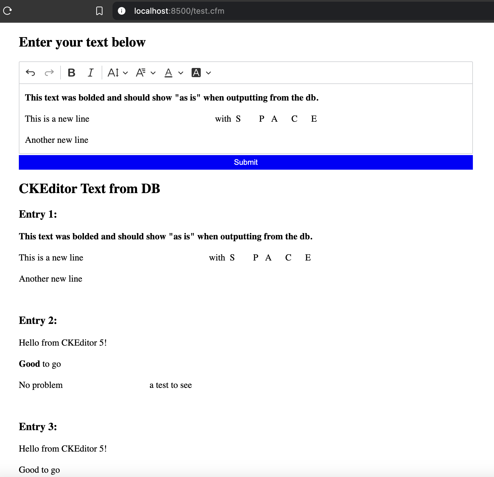

# CKEditor 5 ColdFusion Integration to Persist Formatting

This simple repository shows how to integrate CKEditor into a ColdFusion project. It includes features such as saving CKEditor content to a MySQL database and retrieving the saved content in the original format.

## Features

- Integration of CKEditor 5 with ColdFusion
- Save and retrieve formatted content using a MySQL database

## Prerequisites

- Adobe ColdFusion or Lucee server
- MySQL database or any other supported database
- CKEditor 5

## Setup Instructions

1. Clone the repository to your ColdFusion web root.

   ```bash
   git clone https://github.com/wicfasho/ckeditor-format-preserver.git
   ```

2. Create the database table using the provided schema:

   ```sql
   CREATE TABLE user_content (
       id INT AUTO_INCREMENT PRIMARY KEY,
       user_id INT NOT NULL,
       content TEXT NOT NULL,
       created_at TIMESTAMP DEFAULT CURRENT_TIMESTAMP
   );
   ```
   > This is already being done on Application startup. Update `ckeditor_test` to your datasource or create a new one

3. Run the project on your ColdFusion server (e.g., `http://localhost:8500/test.cfm`).

## Usage

1. Enter text into the CKEditor form and click **Submit**. The content will be saved to the database.
2. The submitted content will be displayed below the editor in the same formatting.

## Screenshots

Here is a screenshot of the project in action:


